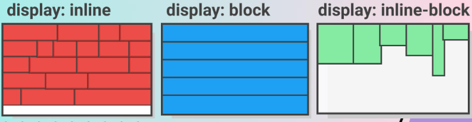

**<h1 style="text-align: center;">Fundamento CSS</h1>**

Hojas de Estilo en Cascada (del inglés Cascading Style Sheets) o CSS es el lenguaje de estilos utilizado para describir la presentación de documentos HTML o XML (en-US) (incluyendo varios languages basados en XML como SVG, MathML o XHTML). CSS describe como debe ser renderizado el elemento estructurado en la pantalla, en papel, en el habla o en otros medios.

CSS es uno de los lenguajes base de la Open Web y posee una especificación estandarizada por parte del W3C. Anteriormente , el desarrollo de varias partes de las especificaciones de CSS era realizado de manera sincrónica, lo que permiía el versionado de las recomendaciones. Probablemente habrás escuchado acerca de CSS1, CSS2.1, CSS3. Sin embargo, CSS4 nunca se ha lanzado como una versión oficial.

Desde CSS3, el alcance de las especificaciones se incrementó de forma significativa y el progreso de los diferentes modulos de CSS comenzó a mostrar varias diferencias, lo que hizo más efectivo desarrollar y publicar recomendaciones separadas por módulos. En vez de versionar las especificaciones de CSS, la W3C actualmente realiza una captura de las ultimas espcificaciones estables de CSS.


## **Metodologia de BEM**

***

BEM (**Block Element Modifier**) es un metodología que nos proporciona una manera de nombrar a nuestras clases en HTML para posteriormente poder usarlo en CSS, BEM nos ayudará a mantener nuestro código flexible, modular y sencillo. Sobre todo al lidiar con problemas sobre especificidad.

BEM significa Block Element Modifier, esto es debido a que todas las clases que escribiremos se regiran por estas 3 partes, ejemplo:

 * **"block__element--modifier"**

### **Block:** 

Es una parte independiente en nuestro HTML, no necesita de otros elementos para existir. Por ejemplo, una galeria de imágenes o un menú, no necesita de otros elementos para existir. 

Los bloques tienen el nombre de lo que representará, ejemplo: 

* "header"
* "menu"
* "galery"
* "footer"

### **Element:**

Un elemento siempre estará dentro de un bloque, debido a que es parte de él y es dependiente del bloque, por ejemplo una imágen necesita una galeria de imagenes para existir, o un enlace necesita de un menu para existir.

Los elementos tendrán el nombre primero de el bloque al que pertenece, dos guiones bajos y despues el nombre de lo que representará, ejemplo: 

* "header__title" 
* "menu__item"
* "galeria__img"
* "footer__img"

### **Modifier:**

Los modificadores son usados en elementos o bloques, se usan para representar una caracteristica diferente que tendrá el modificador o elemento.

Los modificadores tendrán el nombre del bloque o del elemento, después otras vez el nombre del elemento, dos guiones medios y la característica diferente que tendrá este bloque o elemento, ejemplo:

* "header__title--red" 
* "menu__item--rotate"
* "galeria__img--hover"
* "footer__img--shadow"
* "form__button--active"
* "nav__link--active"

## **Selectores**

---

En CSS , los selectores se utilizan para apuntar a los elementos HTML en nuestras páginas web que queremos diseñar. Hay una amplia variedad de selectores de CSS disponibles, lo que permite una gran precisión al seleccionar elementos para diseñar.

Es un patrón de elementos y otros términos que le indican al navegador qué elementos HTML deben seleccionarse para que se les apliquen los valores de propiedad CSS dentro de la regla. El elemento o elementos seleccionados por el selector se denominan sujeto del selector .

### **Selectores simples**

* Selectores elementales 
  * Selector universal -> *
  * Selector de etiqueta -> nombre de la etiqueta  
* Selectores de atributos
  * ID del elemento -> #
  * Clase del elemento -> .
  * Otros atributos
    * [atributo] -> Seleccion de elementos segun la presencia de un atributo determinado
    * [atributo="valor"] -> Selección de elementos basada en la presencia de un atributo que tiene un valor particular asignado
    * [atributo^="valor"] -> Filtro unicamente para elementos con un atributo, cuyo valor comienza con valor
    * [atributo*="valor"] -> Filtro para hallar un valor en cualquier lugar dentro de la cadena
    * [atributo$="valor"] -> Filtro unicamente para elementos con un atributo, cuyo valor finaliza con valor
  
### **Selectores compuestos**

* Selectores agrupados -> Se agrupan los selectores separados por ,
* Selectores combinados (Se recomienda no bajar mas de 2 niveles)
  * Selector de hijo directo -> Se agrupan los selectores separados por >
  * Selector de hijo descendiente -> Se agrupan los selectores separados por espacios
  * Selector de hermano adyacente -> Se agrupan los selectores separados por el simbolo de +
  * Selector de hermanos generales -> Se agrupan los selectores separados por ~
* Pseudoclases - Pseudoelementos

```css
*{
    /* Selector universal */
}

body{
    /* Selector por etiqueta */
}

.nombre-clase{
    /* Selector por clase */
}

#nombre-id{
    /* Selector por ID */
}

.clase1, .clase2{
    /* Selectores agrupados */
}

.clase1 > .clase2{
    /* Selector de hijo directo */
}

.clase1 .clase2{
    /* Selector de hijo descendiente */
}

.hermano1 + .hermano2{
    /* Selector de hermano adyacente */
}

.hermano1 ~ .hermano2{
    /* Selector de hermanos generales */
}

[nombre-atributo = "atributo"] {
    /* Selector por atributo */
}

a:hover {
    /* Selector por pseudoclases */
}
```

## **Herencia, especificidad y cascada**

***

La **herencia** está relacionada con cómo los elementos del etiquetado de HTML heredan propiedades de sus elementos padres (los que los contienen) y los transmiten a sus hijos.

La **especificidad** es la manera mediante la cual los navegadores deciden qué valores de una propiedad CSS son más relevantes para un elemento y, por lo tanto, serán aplicados. La especificidad está basada en las reglas de coincidencia que están compuestas por diferentes tipos de selectores CSS.

* **Selector Specifity:**
  * Selector universal ----------------------- 0,0,0,0
  * Etiquetas y pseudoelementos ------- 0,0,0,1
  * Clases, atributos y pseudoclases ---- 0,0,1,0
  * ID ---------------------------------------- 0,1,0,0
  * Estilos en linea -------------------------- 1,0,0,0
  * !important ------------ Rompe la especificidad

La **cascada** en las hojas de estilo significa que el orden de las reglas importa en CSS: cuando dos elementos tienen la misma especificidad, se aplica la que aparece en último lugar en el CSS.

### **¿Como funciona?**

***

Cuando un navegador carga una página web, combina el contenido (HTML) con la información de estilos (CSS). Procesa estos archivos en etapas. A continuación te muestro un modelo simplificado de lo que pasa:

 

A diferencia de otros lenguajes, CSS no arroja un error ni se interrumpe si detecta una línea que no puede analizar, durante su lectura. La cascada de CSS lee de arriba hacia abajo, filtra y clasifica las reglas de acuerdo a su importancia, si no puede analizar un valor lo tomará como no válido y por lo tanto lo ignora.

## **Propiedades de texto**

***

```css
.propiedades_de_texto{
    font-size: 16px;             /*Tamaño de la fuente*/
    font-family: 'Open Sans';  /*Tipo de fuente*/
    line-height: 2;              /*Espacio entre lineas y parrafos*/
    font-weight: 100;            /*Grosor de la fuente*/  
}
```

## **Unidades de medida**

**Absoluta:**
* px
* cm
* mm

**Relativas:**
* em
* rem
* %

**viewport**
* vw
* vh
  
***

## **Box model (Height, Width, Padding, Border, Margin, Display bock inline inline-block)**

***

Cada elemento en una página web es un bloque rectangular separado. El Box model se entiende por el espacio que ocupa el elemento en la página web y estos elementos cuentan con las siguientes propiedades:

* **Content (Height y Width)**
* **Padding**
* **Border**
* **Margin**
   
y depende del valor del atributo  box-sizing.

Dentro del modelo de caja hay que considerar que una caja tendra 4 lados:

* **Top**<br>
* **Right**<br>
* **Bottom**<br>
* **Left**<br>


### **Height y Width**

***

**Propiedades de dimencion**

* height -> Establece el alto de un elemento
* max-height -> Establece el alto maximo de un elemento
* max-width -> Establece el ancho maximo de un elemento
* min-height -> Establece el alto minimo de un elemento 
* min-width -> Establede el ancho minimo de un elemento
* width -> Establece el ancho de un elemento

### **Padding, Border y Margin**

***

**Padding:**<br>
Es la propiedad que nos permite generar espacio interno entre el border y el content. Es un shorthand (Propidedad abreviada) que controla los 4 lados posibles a los que dar padding.
```css
.box{
    padding-top: 10px;
    padding-right: 10px;
    padding-bottom: 10px;
    padding-left: 10px;
}

.box{
     /*top | right | bottom | left*/
    padding: 10px 10px 10px 10px;
}

.box{
     /*top | right + left| bottom*/
    padding: 10px 10px 10px;
}

.box{
     /*top + bottom | right + left*/
    padding: 10px 10px;
}

.box{
     /*top + right + bottom + left*/
    padding: 10px;
}
```

**Border:**<br>
Es una propiedad que nos permite modificar el borde de la caja. Es un shorthand que agrupa 3 propiedades, que a su vez esas 3 propiedades agrupan 4 propiedades.

```css
.box{
    border-width: 3px;
        /* border-top-width: 3px; */
        /* border-right-width: 3px; */
        /* border-bottom-width: 3px; */
        /* border-left-width: 3px; */
    border-style: solid;
        /* border-top-style: solid; */
        /* border-right-style: solid; */
        /* border-bottom-style: solid; */
        /* border-left-style: solid; */
    border-color: white;
        /* border-top-color: white; */
        /* border-right-color: white; */
        /* border-bottom-color: white; */
        /* border-left-color: white; */
}
 
.box{
    /* width | style | color  */
    border: 3px solid white;
}
```

**Margin:**<br>
Es la propiedad que nos permite generar espacio entre elementos. Es un shorthand (Propiedad abreviada) que controla los 4 lados posibles a los que dar margenes.

```css
.box{
    margin-top: 10px;
    margin-right: 10px;
    margin-bottom: 10px;
    margin-left: 10px;
}

.box{
     /*top | right | bottom | left*/
    margin: 10px 10px 10px 10px;
}

.box{
     /*top | right + left| bottom*/
    margin: 10px 10px 10px;
}

.box{
     /*top + bottom | right + left*/
    margin: 10px 10px;
}

.box{
     /*top + right + bottom + left*/
    margin: 10px;
}
```

Un recurso muy utilizado con la propiedad margin es el centrado de elementos (content o caja) como se muestra en la siguiente linea:

```css
.box{
    /* Aplica si el elemento es bloque y tiene definido el width */
    width: 100px;
    margin: 0 auto;     
}

.box{
    /* En caso de ser un elemento en linea se agrega las sig. propiedad */
    display: block;
    width: 100px;
    margin: 0 auto;     
}
```

Colapso de margenes entre padres e hijos, se pueden solucionar de 3 maneras, como se muestra de la siguiente forma:

```css
container{
    background-color; lightcoral;
    height: 100px;
    /* overflow: hidden; */
    /* padding-top: .1px; */
    /* border-top: .1px solid lightcoral; */
}

element{
    margin: 0;
    margin-top: 30px
}
```

### **Display block, inline y inline-block**

***

La propiedad display es muy importante para controlar el diseño en css ya que determina si/como se muetra un elemento. Cada elemento HTML tiene un valor de visualizacion predeterminado segun el tipo de elemento que sea. El valor de visualizacion predeterminado para lamayoria de los elementos es **block** o **inline**.

**Display none:**<br>
Oculta el contenido del elemento, pero se siguie cargando en la pagina.

**Display block:**<br>
Un elemento a nivel de bloque siempre comienza en una nueva línea y ocupa todo el ancho disponible (se extiende hacia la izquierda y hacia la derecha tanto como sea posible).

* Ocupa todo le ancho disponible.
* Tiene dimencionesl modigicables (alto y ancho).
* No permite otros elementos a su lado (aunque especifique un ancho, siguie ocupando el ancho disponible, generando saltos de linea).

**Display inline:**<br>
Un elemento en línea no comienza en una nueva línea y solo ocupa el ancho del contenido.

* Ocupa el espacio necesario para mostrar el contenido.
* No tiene dimenciones modificables (alto y ancho)
* Permite otros elementos a su lado.
* Padding y margin solo empujan a elementos adyacentes en horizontal, NUNCA EN VERTICAL.

**Display inline-block:**<br>
En comparación con display: inline, la principal diferencia es que display: inline-block permite establecer un ancho y alto en el elemento.

Además, con display: inline-block, se respetan los márgenes/rellenos superior e inferior, pero con display: inline no.

En comparación con display: block, la principal diferencia es que display: inline-block no agrega un salto de línea después del elemento, por lo que el elemento puede ubicarse junto a otros elementos.



**Display flex:**

**Display grid:**

## **Overflow**

***

La propiedad overflow especifica: si recortar contenido, dibujar barras de desplazamiento o mostrar el contenido excedente en un elemento a nivel de bloque.

```css
.caja_1{
    overflow: visible;
}

.caja_2{
    overflow: hidden;
}

.caja_3{
    overflow: scroll;
}

.caja_4{
    overflow: auto;
}
```


## **Box-shadow y Border-radius**

***

**Box-shadow:**
La propiedad CSS box-shadow añade efectos de sombra alrededor del marco de un elemento. Se pueden definir multiples efectos separados por comas. Box-shadow se describe por los desplazamientos en  X y Y, los radios de desenfoque y dispersion, y el color relativo al elemento.

```css
/* offset-x | offset-y | color */
box-shadow: 60px -16px teal;

/* offset-x | offset-y | blur-radius | color */
box-shadow: 10px 5px 5px black;

/* offset-x | offset-y | blur-radius | spread-radius | color */
box-shadow: 2px 2px 2px 1px rgba(0, 0, 0, 0.2);
```

**Border-radius:**
La propiedad CSS redondea las esquinas del borde exterior de un elemento. Puede establecer un solo radio para hacer esquinas circulares o dos radios para hacer esquinas elípticas.

```css
border-top-left-radius: 50px;
border-top-right-radius: 100px;
border-bottom-right-radius: 150px;
border-bottom-left-radius: 200px;

/* top-left | top-right | bottom-right | bottom-left */
border-radius: 50px 100px 150px 200px;

/* top-left | top-right + bottom-left | bottom-right  */
border-radius: 50px 100px 150px;

/* top-left + top-right | bottom-right + bottom-left */
border-radius: 50px 100px;

/* top-left + top-right + bottom-right + bottom-left */
border-radius: 50px;
```

## **Background y Color**

***

Las propiedades de fondo de CSS se utilizan para agregar efectos de fondo a los elementos.

**Background:**
* background-color -> Define el color de fondo de un elemento.
  * RGB.
  * Hexadecimal.
  * HSL.
  * Definido.
* background-image -> Establece una omas imagenes de fondo para el elemento.
  * url()
  * linear-gradient.
* background-repeat -> Define como se repiten los fondos, puede ser repetido sobre el eje X o Y, ambos o no estar repetido.
  * no-repeat
  * repeat, repeat-X y repeat-Y
  * round
  * space
* background-position -> Define la posicion inicial de la imagen de fondo especificada.
  * center
  * top
  * right
  * left
  * bottom
* background-size -> Especifica el tamaño de las imagenes de fondo.
  * cover.
  * contain.

***

Los colores se especifican utilizando nombres de color predefinidos o valores RGB, HEX, HSL, RGBA, HSLA.
Un valor de color RGB representa las fuentes de luz ROJA, VERDE y AZUL.
En CSS, un color se puede especificar como un valor RGB, utilizando esta fórmula:
rgb ( rojo, verde , azul )
Cada parámetro (rojo, verde y azul) define la intensidad del color entre 0 y 255.

**Colores:**
* Definidos.
* Hexadecimal.
* RGB.
* HSL.
 

```css
color: white;

     /* red, green, blue, alpha */
color: rgb(255, 0, 125, 0.5) ;
```

## **Postion y sus propiedades**

***

**Tipos de posicionamiento:**
* Static (default)
* Relative
* Absolute
* Fixed
* Sticky

La propiedad position de CSS especifica como un elemento es posicionado en el documento. Al asignar un tipo de position a un elemento se desbloquean 5 propiedades nuevas.

**Propiedades de un elemento posicionado:**
* top
* right
* buttom
* left
* z-index

NOTA: Si a un elemento le declaramos la propiedad top y/o left, las propiedades bottom y/o right no funcionaran

### **Static:**
El elemento static es el valor por defecto, es posicionado de acuerdo al flujo del documento. Las propiedades top, right, bottom, left and z-index no tienen efecto.

### **Relative:**
El elemento no sera remobido del flujo, establecer las propiedades top, right, bottom e left hará que se ajuste fuera de su posición normal. El resto del contenido no se ajustará para encajar en ningún espacio dejado por el elemento.

### **Absolute:**
El elemento es removido del flujo normal, sin crearse espacio alguno para el elemento. Siempre se posicionara en base a su padre que tenga un position direfete a static y en caso de no tenerlo va a posicionarse en base al viewport del navegador.

### **Fixed:**
El elemento es completamente removido del flujo al igual que absolute, pero a diferencia de que el elemento se posiciona directamente al viewport y se quedara pegado sin importar cuanto scroll se haga. 

### **Sticky:**
Es una conbinacion de posicionamiento realative y fixed, las propiedades top, left, bottom y right no mueven el elemento, sirven como un punto de referencia, mientras no lleguen a ese valor el elemento se comporta como relative, cuando llega se convierte en fixed.

Para que este comportamiento funcione el elemento sticky debe ser hijo directo del body o su elemento contenedor debe tener dimensiones definidas y solo sera sticky dentro de las dimensiones de su contenedor.

### **Z-index:**
Todos los elementos posicionados desbloquean un contexto de apilamiento. El cual nos permite definir que elemento estara por encima de otro en caso de que ocupen el mismo espacio.

## **Media queries**

***

**Max-Width:**
Max-Width en un mediaquerie indica cuál sera el valor maximo que debe tener el viewport para que se aplique en CSS que esta dentro de el mediaquerie, es decir si tenemos una max-width de 600px, significa que el mediaquerie entrará siempre y cuando el viewport sea menor a 600px porque max-width define el tamaño maximo al cual se cumplirá la condicion.

**Min-Width:**
Min-Width en un mediaquerie indica cuál será el valor minimo que debe tener el viewport para que se aplique el CSS que estra dentro de el mediaquerie. es decir si tenemos un min-width de 600px, significa que el mediaquerie estrará siempre y cuando el viewport sea mayor a 600px porque min-width define el tamaño minimo que se necesita para que el mediaquerie cumpla la condicion.

## **Responsive design**

***

Adaptar nuestras páginas a cualquier dispositivo se ha vuelto imprescindible en un época de diversos dispositivos con acceso a internet, para eso tenemos 2 técnicas para adaptar a dispositivos, la primera técnica se llama mobile firdt y la segunda desktop first 

### **Mobile First:**
Se basa en maquetar primero el sitio pensando en dispositivos móbiles, y posteriormente agregar media queries para adaptarlo a un tamaño más grande (Desktop). Esta es la mejor opción debido a que es mas fácil adaptar un diseño de Mobile a Desktop, que de Desktop a Mobile.

### **Desktop First:**
Se basa en maquetar primero el sitio pensando en dispositivos desktop, y posteriormente agregar media queries para adaptarlo a un tamaño más pequeño (Mobile). Esta es la mejor opción debido a que es mas fácil adaptar un diseño de Desktop a Mobile, que de Mobile a Desktop.


## **Flexbox**

***

Es un método que puede ayudar a distribuir el espacio entre los ítems de una interfaz y mejorar las capacidades de alineación. Es un sistema unidimensional que nos permite alinear los elementos en una dirección, ya sea de forma horizontal o vertical.
Algunas de las propiedades que se pueden usar en Flexbox para el contenedor y los elementos son:

**Contenedor**
* display
* flex-direction
* flex-wrap
* flex-flow: (flex-direction flex-wrap)
* justify-content
* align-items
* align-content

**Elementos**
* order
* flex-grow
* flex-shrink
* flex-basis
* flex
* align-self

## **Grid**

***

Es un sistema de diseño que permite alinear elementos en columnas y filas. Es un sistema bidimensional.
Algunas de las propiedades que se pueden usar en CSS Grid para el contenedor y los elementos son:

**Contenedor**
* display
* grid-template-columns
* gap
* column-gap
* justify-items
* align-items
* justify-content
* align-content
  
**Elementos**
* grid-column
* grid-row
* grid-area
* justify-self
* align-self

### Fila y Columnas

Se le llama Grid por que se utilizan filas y columnas. Estas filas y columnas crean una cuadricula. Cada fila y columna esta formada por dos lineas (Grid-lines). 

## Custom Properties

***


## Ordenar Propiedades

***

```css
.class{
    /* Position */
    position: relative;
    top: 200px;
    left: 100px;

    /* Box Model */
    display: flex;
    justify-content: space-around;
    align-items: center;
    width: 100%;
    height: 70px;
    padding: 10px;
    margin: 50px 80px;
    overflow: hidden;

    /* Text */
    font-size: 24px;
    text-align: center;

    /* Visual */
    color: white;
    border: 4px solid gray;
    border-radius: 40px;

    /* Varios    */
}
```


!!! note Liks de apoyo CSS
    * https://cssreference.io/
    * https://codeguide.co/
    * repasar prefijos propietarios doriandesing 2:07:00


3 formas para solucionar el colapsado de imagenes
overflow: hidden
pading-top: 0.1px
border-top: 0.1px solid color;

Herramientas 

Colores difuminados para fondos: https://webgradients.com
Iconos svg: https://boxicons.com
            https://www.pexels.com/es-es/
Imagenes sin derechos de hautor: https://unsplash.com
Dubujos sin derecho de auto: https://undraw.co/
Generador de waves: https://getwaves.io/


