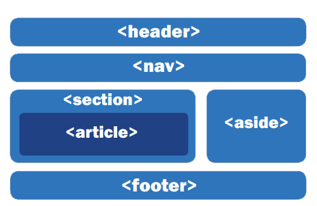

<style>
:root{
    --title: #ed3966;
}    


</style>


***

<h1 align="center">Desarrollo Web</h1>

***


## ¿Que es HTML?

<p style='text-align: justify'>
    El documento que lee el navegador está escrito en un lenguaje de marcado llamado HTML, que son las siglas de HyperText Markup Language (Lenguaje de marcas de hipertexto), o lo que es lo mismo, un lenguaje de etiquetas que permite incluir o hacer referencia a todo tipo de información. Además de HTML, generalmente se utilizan otras tecnologías para describir la apariencia/presentación de una página web (<span style="color:#ed3966"><b>CSS</b></span>) o la funcionalidad/comportamiento (<span style="color: var(--title)"><b>JavaScript</b></span>).<br><br>
    HTML no es un lenguaje de porgramacion, es un lenguaje de estructura. Es la base con la que estan creadas todas las paginas Web del mundo.<br><br>              
</p>

!!! note <span style="color:#ed3966"><b>CSS</b></span>
    <p style='text-align: justify'>
    Hojas de Estilo en Cascada (del inglés Cascading Style Sheets) o CSS es el lenguaje de estilos utilizado para describir la presentación de documentos HTML o XML (en-US) (incluyendo varios languages basados en XML como SVG, MathML o XHTML). CSS describe como debe ser renderizado el elemento estructurado en la pantalla, en papel, en el habla o en otros medios.
    </p>

!!! note <span style="color:#ed3966"><b>JavaScript</b></span>
    <p style='text-align: justify'>
    JavaScript (JS) es un lenguaje de programación ligero, interpretado, o compilado justo-a-tiempo (just-in-time) con funciones de primera clase. Si bien es más conocido como un lenguaje de scripting (secuencias de comandos) para páginas web, y es usado en muchos entornos fuera del navegador, tal como Node.js, Apache CouchDB y Adobe Acrobat JavaScript es un lenguaje de programación basada en prototipos, multiparadigma, de un solo hilo, dinámico, con soporte para programación orientada a objetos, imperativa y declarativa (por ejemplo programación funcional). Lee más en acerca de JavaScript.
    </p>

---

## Front-End Developer

<p style='text-align: justify'>
Un Front-end Developer es aquella persona encargada de programar el navegador de una web, es decir, es el encargado de traducir las definiciones de diseño y estilo visual realizadas en etapas previas a códigos HTML semántico. Es una de las piezas fundamentales en un proyecto digital.

**Principalmente, las funciones de un Front-end Developer serán:** 

* Traducir el diseño de un sitio a código HTML y CSS. 
* Estructurar el contenido semánticamente
* Asegurar la accesibilidad 
* Controlar tipografías, plantillas, formas del diseño y la interactividad. 
* Programar, cambiar y mantener un sitio web. 
* Adaptar el diseño de una web a diversos dispositivos y navegadores. 
* Crear herramientas que mejoren la interacción entre usuario y web.
* Usar APIs para conectar la web con servicios y sistemas. 
</p>
  
## Back-End Developer

<p style='text-align: justify'>
Un Back-End Developer es un programador que trabaja del lado del servidor. Permitiendo que todo lo que vemos cuando interactuamos con una aplicación o sitio web, funcione. Dicho de una forma más informal, es el que trabaja detrás del escenario, moviendo los hilos para que todo salga bien.

**Principalmente, las funciones de un Front-end Developer serán:** 

* Comprension de los parametros y criterios de diseño.
* Diseño y programacion de plantillas, temas e interfaces.
* Destrezas sobresalientes en el manejo de bases de datos.
* Automatizar tareas de desarrollo de software.
* Manejo de las librerias del servidor.
* Mantener conectadas las bases de datos con las soluciones.
* Configurar y mantener los servidores.
</p>

<div align="center">
    
</div>

## Full-Stack Developer

<p style='text-align: justify'>
Es un profesional que cuenta con diversas habilidades informáticas; es decir, es un perfil híbrido, multiskill que puede desenvolverse en el front-end, back-end de un desarrollo web. 

**Un Full-Stack Developer hace tareas como**:

* El desarrollo de la interfaz y arquitectura del sitio web.
* Diseña interfaces de usuario y otras funcionalidades front-end.
* Es capaz de desarrollar aplicaciones back-end.
* Tiene la responsabilidad de crear servidores y base de datos para su correcta operatividad.
* Garantiza la funcionalidad de las aplicaciones y páginas en dispositivos móviles.
* La velocidad y escalabilidad del proyecto también está entre sus funciones.
* Administra proyectos complejos.
* Asesora a otros departamentos del área tecnológica.
</p>

---

## Paginas estaticas & dinamicas


#### Sitios Web Estáticos

<p style='text-align: justify'>
La información que contiene se mantiene constante y estática. No se actualiza con la interacción del usuario. Es conveniente para realizar landing pages (páginas informativas o de aterrizaje) o blogs. Se mostrarán siempre iguales para todos los usuarios.

**Ejemplo de páginas estáticas:**
* Menú de un restaurante
* Blog de viajes
* Página informativa de un negocio
</p>

#### Sitios Web Dinámicos

<p style='text-align: justify'>
También conocidos como aplicaciones web, actualizan su información con respecto a la interacción del usuario. Dependen de una base de datos, de donde extrae e ingresa información. Serán diferentes, dependiendo del usuario que la use y la información que se ingrese.

**Ejemplo páginas dinámicas:**
* Sistema de reporte de ventas
* Linkedin
* Banco en línea
</p>

***

## Estrucutra basica de HTML en una pagina web

<div Style align="center">
    
</div>

***

## Index y estructura basica

```html
<!DOCTYPE html>   <!--Indica al navegador que el contenido es HTML-->  
<html lang="en">    <!--Inicio del documento HTML-->
<head>    <!--Contendra los metadatos para que el navegador cargue sin porblemas-->
    <title>Document</title>
</head>
<body>    <!--Representa el contenido de la pag. Web--> 
    <header>    <!--Encabezado de la pag. Web-->
        <nav>    <!--Barra de navegacion-->
            <ul>
                <li></li>    <!--Menu de navegacion--> 
            </ul> 
        </nav>
    </header>
    <main>    <!--Contedido principal de la pag. Web-->
        <section>    
            <article>

            </article>
        </section>
        <aside>    <!--Contenido secundario de la pagina-->

        </aside>
        <footer>    <!--Pie de pagina-->
            
        </footer>
    </main>
</body>
</html>
```
***

## Elementos de bloque & elementos en linea

Los **elementos de bloque** van a ocupar todo el ancho disponible aunque su contenido no lo haga, por lo que los elementos que pongamos a continuacion saltaran a la siguiente linea.

Los **elementos en linea** Un elemento en línea ocupa sólo el espacio delimitado por las etiquetas que definen el elemento en línea. 
***

## Etiqueta ***`<head>` `</head>`***

El elemento ***`<head>`*** de un documento HTML es la parte que no se muestra en el navegador cuando se carga la página. El elemento HTML ***`<head>`*** provee información general (metadatos) acerca del documento, incluyendo su título y enlaces a scripts y hojas de estilos. la función de la cabecera es contener los metadatos del documento.

```html
<head>    
    <script src="../public/js/script.js"></script>    <!--Enlaza un documento de tipo JS-->
    <link rel="stylesheet" href="../public/css/style.ccs">    <!--Enlaza un documento de tipo CSS-->
    <link rel="icon" href="ruta o url">
    <title>Document Title</title>    <!--Nombre de la pestaña del navegador-->
</head>

```

**Algunos metadatos que deveria contener las etiquetas** ***`<head>` `</head>`***

```html
<head> 
    <meta charset="UTF-8">    <!--Mostrara en la pag. web caracteres especiales-->
    <meta name="description" content="Esta pagina mostrara...">    <!--Debajo del url se mostrara una descripcion de la pagina-->
    <meta name="robots" content="index,follow">    <!--Ayuda al posicionamiento de la pag. en la web-->
    <meta http-equiv="X-UA-Compatible" content="IE=edge">
    <meta name="auth    or" content="ChenCho">
    <meta name="viewport" content="width=device-width, initial-scale=1.0">    <!--Escala el contenido si es abierto desde un dispositivo mobil o pc-->
</head>
```

## Etiqueta ***`<body>` `</body>`***

El elemento ***`<body>`*** de HTML representa el contenido de un documento HTML. Solo puede haber un elemento ***`<body>`*** en un documento.

```html
<body>
    <header>
        <nav>
            
        </nav>
    </header>
    <Main>
        <section>
            <article>
            
            </article>
        </section>
    </Main>
    <footer>

    </footer>
</body>
```

## Etiquetas ***`<Section>` `<Article>` & `<Aside>`***

**Section:** Es un contenedor genérico que agrupa contenido que esta relacionado. Cuando creamos bloques cuyo contenido es parte de un bloque total usaremos section. 

```html
    <main>
        <section>
            <h2>Navegadores mas usados en 2022</h2>
            <article>
                <header>
                    <h3>Chrome</h3>
                </header>
                <p>Lorem ipsum dolor sit amet consectetur adipisicing elit.</p>
                <footer>Creado por google</footer>
            </article>
        </section>
    </main>
```

**Article:** Es un contenedor que representa contenido independiente, es decir, podemos leer ese fragmento en cualquier otro sitio y tendría sentido por si mismo.

```html
    <main>
        <article>
            <h2>Navegadores mas usados en 2022</h2>
            <section>
                <header>
                    <h3>Chrome</h3>
                </header>
                <p>Lorem ipsum dolor sit amet consectetur adipisicing elit.</p>
                <footer>Creado por google</footer>
            </section>
        </article>
    </main>
```

**Aside:** Se utiliza para representar contenido relacionado pero que no forma parte del contenido principal

```html
<section></section>
<article></article>
<aside></aside>
```

## Etiquetas basicas de HTML

```html
<body>
    <!-- Etiquetas para titulos -->
    <h1>Hola mundo</h1> <!--Se recomienda tener un elemento h1 para posicionar la pag. Web-->
    <h2>Hola mundo</h2>
    <h3>Hola mundo</h3>
    <h4>Hola mundo</h4>
    <h5>Hola mundo</h5>
    <h6>Hola mundo</h6>

    <!-- Etiqueta parrafo -->
    <p>
        Lorem ipsum, dolor sit amet consectetur adipisicing elit. Facere dolorum quo nihil suscipit dolore id deserunt sapiente maiores nobis, perspiciatis labore voluptatem, similique, ab soluta enim repudiandae impedit deleniti modi.
    </p>

    <!-- Estilos de letra -->
    <b>Negrita</b>
    <i>Italica</i>
    <strike>Tachada</strike>
    <small>Chiquita</small>
    
    <!-- Salto de linea -->
    <br>

    <!-- Listas Ordenadas -->
    <h1>Verduras</h1>
    <ol>
        <li>Gitomate</li>
        <li>Tomate</li>
        <li>Cebolla</li>
        <li>Zanahoria</li>
        <li>Papas</li>
    </ol>

    <!-- Listas Desordenadas -->
    <h1>Frutas</h1>
    <ul>
        <li>Platano</li>
        <li>Narangas</li>
        <li>Limones</li>
        <li>Manzanas</li>
        <li>Peras</li>
    </ul>


    <!-- Tabla -->
    <table>
        <thead> 
            <tr>
                <th></th>
                <th></th>
                <th></th>
            </tr>
        </thead>
        <tbody>
            <tr>
                <th></th>
                <td></td>
                <td></td>
            </tr>
        </tbody>
        <tfoot>
            <tr>
                <th></th> 
                <td></td> 
                <td></td> 
            </tr>
        </tfoot>
    </table>
</body>
```

## Enlaces externos & locales

Los **enlaces locales** son aquellos que apuntan de una página a otra de tu sitio.

Los **enlaces externos** son los que apuntan a una página en otro dominio.

```html
 <a href="Ubicacion o url de la pagina web">Click Aquí</a>

 <a href="#Titulo_2">Click Aquí para ir al tirulo 2</a>
 <h2 id="Titulo_2">Titulo 2...</h2>

 

 <video src="Ubicacion o url del video" controls></video>

 <audio src="Ubicacion o orl del audio" controls></audio>
```

!!! Note Atributo target
    **Target:** Si queremos que al momento de dar clik en el enlace abra otra pestaña totalmente independiente se hace uso del atributo **target = "_BLANK"** de la siguiente manera:

```html
<a href="https://www.youtube.com/" target="_BLANK">Click para volver</a>    
```

**Dowload:** Atributo booleano sirve para descargar el recurso solicitado. Importante, el recurso debe estar en el mismo servidor. 
    
```html
<a href="Ubicacion dentro del Proyecto" download>Click Aquí</a>
```

## Formularios ***`<fomr>` `</fomr>`***

Los formularios son una forma sencilla de establecer mecanismos para que el usuario pueda introducir información en una página web de forma sencilla e intuitiva, y el sitio web sea capaz de procesarla correctamente y añadirla en una base de datos de la página, enviarla por email o procesarla para mostrar información final al usuario.

```html 
<form action="">
    <span>Nombre</span>
    <label for="nombre">
        <input type="text" id="nombre"> 
    </label>
    <span>Ciudad</span>
    <label for="ciudad">
        <input type="country" id="ciudad"> 
    </label>
    <span>Edad</span>
    <label for="edad">
        <input type="int" id="edad"> 
    </label>
</form>
```

### Formularios y sus atributos:   

https://lenguajehtml.com/html/formularios/crear-un-formulario/

## Tablas ***`<table>` `</table>`***

## Atributos

Los atributos son valores adicionales que configuran los elementos y/o ajustan su comportamiento.

* **Comunes:**
  Su sintaxis es -> atributo = "valor"

* **Booleanos:**
  Su sintaxis es -> atributo

***


<!-- https://www.youtube.com/watch?v=vz4z0RLcAyk&t=143s -->
<!--todo REPASAR TEMA TABLAS 2:47:19-->
<!--todo REPASAR TEMA IAMGENES DE BITS A WEBP 3:48:19-->
<!--todo REPASAR TEMA GET VS POST EN FORMULARIOS 2:23:03-->
<!--todo REPASAR TEMA FAVICON LIBRERIA 5:48:03-->
<!--todo REPASAR TEMA OPEN GRAPH PROTOCOL 6:10:03-->


<!-- https://www.youtube.com/watch?v=-oK6zL01fNM&list=PLvq-jIkSeTUZYcX9SYwVe7f66afwd9qk_ -->
<!-- todo enviar formulario de manera gratuita sin programacion 6:32:00 -->
<!-- todo REPASAR DATA ATRIBURES 6:45:00 -->

<!-- https://developer.mozilla.org/en-US/docs/Web/CSS/display -->
<!-- https://docs.emmet.io/abbreviations/syntax/ -->


