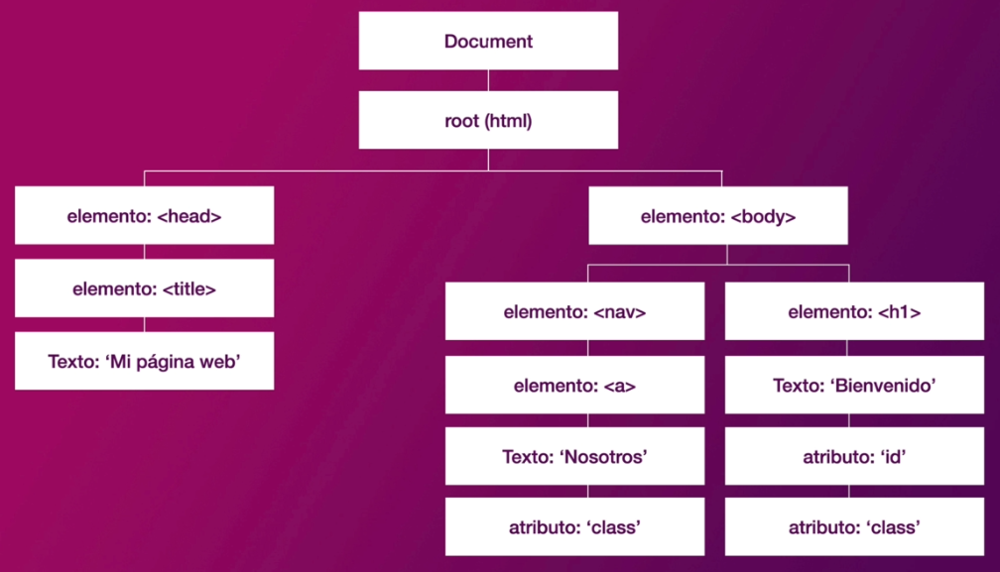

<style>
@import url('https://fonts.googleapis.com/css2?family=Poppins:wght@300&display=swap');
  *{
    /* font-family: 'Open Sans' */
    /* font-family: 'arial' */
    font-family: 'Poppins';
    /* box-sizing: border-box;
    padding: 0;
    margin: 0; */
  }
  h1 {
    text-align: center;
  }
  h2 {
    
  }
</style>

<div align='center'>


<h1>Fundamentos JavaScript</h1>

|  Hola aqui yacen todos mis apuntes y conceptos sobres los fundamentos del lenguaje de programacion JavaScript. |
|---|
---
</div>


JavaScript (JS) es un lenguaje de programación ligero multiplataforma, interpretado, o compilado y orientado a objetos que se utiliza para hacer que las páginas web sean interactivas.

JS permite implementar cosas complejas en páginas web.

* Animaciones complejas.
* Botones con los que interactuar.
* Menus emergentes.

Tambien hay versiones de JS de lado del servidor más avanzadas, como NodeJS, que permite agregar mas funcionalidad a un sitio web.

JS contiene una biblioteca estándar de objetos, como **Array**, **Date** y **Math**, y un conjunto básico de elementos del lenguaje como operadores, estructuras de control y declaraciones.

El núcleo de JS se puede extender para una variedad de propósitos completándolo con objetos adicionales; por ejemplo:

* ###### **JavaScript de lado del cliente:**
  Proporcionar objetos para controlar un navegador y el DOM (Document Objet Model). Por ejemplo las extenciones de lado del cliente permiten que una aplicación coloque elementos en un formulario HTML y responda a eventos del usuario, como clics, formularios y navegacion de paginas.

* ###### **JavaScript de lado del servidor:**
  Proporciona objetos relevantes para ejecutar JS en un servidor. Por ejemplo, las extensiones del lado del servidor permiten que una aplicación se comunique con una base de datos, brinde continuidad de informacion de una invocacion a otra de la aplicacion o realice manipulacion de archivos en un servidor.

Dicho de otra forma JS puede cambiar la apariencia de la página web (DOM). Y, del mismo modo, NodeJS en el servidor puede responder a sulicitudes personalizadas desde el código escrito en el navegador.

# Variables

---

Una variable es un espacio donde podemos almacenar cualquier tipo de dato que prodrá cambiar durante la ejecución del programa. 


**Formas de declarar variables:**

* **Var**: Define una variable global o local en una función sin importar el ámbito del bloque, se puede modificar su valor.

  ```js
  // Las variables declaradas con var pueden ser reasignadas con otro valor
  var myVar = 'Hello world';
  myVar = 2022; 
  ```

* **Let**: Permite declarar variables limitando su alcance (scope) al bloque, esta permite modificar su valor.

  ```js
  // Las variables declaradas con let se les puede reasignar otro valor 
  let myLet = 20;
  myLet = '20'; 
  ```

* **Const**: Permite declarar variables limitando su alcance (scope) al bloque, no se puede modificar el valor porsteriormente.

  ```js
  // Las variables declaradas con const no se pueden modificar 
  const PI = 3.1416;
  PI = 23.22; // No se puede reasignar a una constante
  ```

## Declaracion de una variable: 

Para usar una variable, primero se debe crear, a esto lo llamamos declarar la variable. Para hacerlo, escribimos la palabra reservada `var`, `const` o `let` seguido del nombre con el que se desea llamar a la variable:

```js
var myName; 
let myAge;  

myName;  // Undefined
myAge;   // Undefined
```

Actualmente no tienen ningún valor, son contenedores vacíos. Cuando se ingresan los nombres de las variables, estas devuelven un valor undefined. Si no existen, mostrará un mensaje de error.

## Inicializar Variable

Una vez declarada una variable, se puede inicializar con un valor. Para ello, escribe el nombre de la variable, seguido de un signo igual (=), seguido del valor que deseas darle.

```js
myName = "Chencho";
myAge = 20;

myName; //Armando
myAge;  //20
```

Tambien las variables se pueden declarar e iniciar al mismo tiempo: 

```js
let myName = "Chencho";
let myAge = 20;
```

<a style="color: tomato; font-weight: bold">NOTA:</a> No confundas una variable que existe pero no tiene un valor definido, con una variable que no existe en absoluto — son cosas muy diferentes. No existir significaría que no hay una caja (variable) para guardar un valor. Ningún valor definido significaría que HAY una caja, pero no tiene ningún valor dentro de ella.

## **Scope de una Variable:**

El scope puede definirse como el alcance que una variable tendrá en el código. En otras palabras, el scope decide a qué variables se tiene acceso en cada parte del código. Existen dos tipos de scope, el `scope global` y el `scope local`.

* **Globales:** 
Son aquellas variables declaradas fuera de una funcion o de un bloque con las que podemos acceder a ellas desde cualquier parte del codigo, ya sea dentro o fuera de una función.

  ```js
  const soyEstudiante = true;

  function estudiante() {
	console.log(soyEstudiante);
  }

  estudiante(); //true
  console.log(soyEstudiante); //true
  ```

* **Locales:** 
Son las variables declaradas dentro de una funcion o bloque, solo pueden ser accedidas desde la misma funcion donde se declaro. Si se trata de accerder a la variable se tendra un error de variable no definida.

  ```js
  function estudiante() {
	const soyEstudiante = true;
	console.log(soyEstudiante);
  }

  estudiante(); // true
  console.log(soyEstudiante); // soyEstudiante is not defined
  ```

## **¿Que es el Hoisting?**

El concepto de Hoisting fue pensado como una manera general de referirse a cómo funcionan los contextos de ejecución en JavaScript (específicamente las fases de creación y ejecución).

# Concatenacion e interpolacion

---

## **Concatenación de cadenas**

La concatenación es la accion de unir varias cadenas en una sola. En JavaScript, esto se hace utilizando el operador '+' o el método 'concat()'.

```js
const name = "Armando"
const nickName = "Chencho"
console.log('name: ' + name + 'nick: ' + nickName)
```

## **Interpolación de cadenas**

La interpolación es una forma más moderna y legible de combinar cadenas en JavaScript. Se realiza utilizando plantillas literales (template literals), que son cadenas delimitadas por comillas invertidas (``) y permiten incluir expresiones dentro de ellas utilizando '${}'.

```js
const name = "Armando"
const nickName = "Chencho"
console.log(`name: ${name} nick: ${nickName}`)
```

La interpolación de cadenas es preferida en la mayoría de los casos, ya que es más legible y flexible al permitir la inclusión de expresiones directamente en la cadena. Es importante destacar que la interpolacion con plantillas literales solo funciona con comillas invertidas y no con comillas simples o dobles.

# Operadores en JavaScript

---

<details>
<summary> <h3>Operadores Aritmeticos:</h3> </summary>
<p>
Los operadores aritmeticos toman valores numericos (ya sena literales o variables) como sus operados y retornan un valor numerico unico.

* **Adición ``x + y``**
* **Resta ``x - y``**
* **Multiplicacion ``x * y``**
* **Divición ``x / y``**
* **Resíduo ``x % y``**
* **Post-Incremento en 1 ``a++``**
* **Pre-Incremento en 1 ``++a``**
* **Post-Decremento ``a--``**
* **Pre-Decremento ``--a``**
</p>
</details>

<!-- **Operadores Aritméticos:** Los operadores aritmeticos toman valores numericos (ya sena literales o variables) como sus operados y retornan un valor numerico unico. -->

<!-- * **Adición ``x + y``**
* **Resta ``x - y``**
* **Multiplicacion ``x * y``**
* **Divición ``x / y``**
* **Resíduo ``x % y``**
* **Post-Incremento en 1 ``a++``**
* **Pre-Incremento en 1 ``++a``**
* **Post-Decremento ``a--``**
* **Pre-Decremento ``--a``** -->

<details>
<summary><h3> Operadores de Asignacion:</h3></summary>

<p>
Un operador de asignacion asigna un valor al operado de la izquierda basado en el valor del operando de la derecha.

* **Asignación ``x = y``**
* **Asignación de Adición ``x += y``**
* **Asignación de Resta ``x -= y``**
* **Asignación de Multiplicacion ``x *= y``**
* **Asignación de Divición ``x /= y``**
* **Asignación de Resíduo ``x %= y``**
</p>

</details>

<!-- **Operadores de Asignación:** Un operador de asignacion asigna un valor al operado de la izquierda basado en el valor del operando de la derecha. -->

<!-- | Nombre                        | Operador   |
|-------------------------------|------------|
|Asignación                     |``x = y``   |
|Asignación de Adición          |``x += y``  |
|Asignación de Resta            |``x -= y``  |
|Asignación de Multiplicacion   |``x *= y``  |
|Asignación de Divición         |``x /= y``  |
|Asignación de Resíduo          |``x %= y``  | -->

<!-- * **Asignación ``x = y``**
* **Asignación de Adición ``x += y``**
* **Asignación de Resta ``x -= y``**
* **Asignación de Multiplicacion ``x *= y``**
* **Asignación de Divición ``x /= y``**
* **Asignación de Resíduo ``x %= y``** -->

<details>
<summary><h3>Operadores de Comparacion:</h3></summary>
<p>
Los operadores de comparación comparan dos expresiones y devuelven un valor **Boolean** que representa la relación de sus valores.

* **Igualdad ``x == y``**
* **Diferente ``x != y``**
* **Estrictamente Igual ``x === y``**
* **Desigualdad Estricta ``x !== y``**
* **Mayor que ``x > y``**
* **Mayor o igual que ``x >= y``**
* **Menor que ``x < y``**
* **Menor o igual que ``x <= y``**

</p>
</details>

<!-- **Operadores de Comparacion:** Los operadores de comparación comparan dos expresiones y devuelven un valor **Boolean** que representa la relación de sus valores. -->

<!-- * **Igualdad ``x == y``**
* **Diferente ``x != y``**
* **Estrictamente Igual ``x === y``**
* **Desigualdad Estricta ``x !== y``**
* **Mayor que ``x > y``**
* **Mayor o igual que ``x >= y``**
* **Menor que ``x < y``**
* **Menor o igual que ``x <= y``** -->


<details>
<summary> <h3>Operadores Lógicos:</h3> </summary>
<p>

Los operadores lógicos nos devuelven un resultado a partir de que se cumpla o no una **condición**, su resultado es **Booleano**, y sus operadores son valores lógicos o asimilables a ellos.

* **AND (&&)** 
* **OR (||)**
* **NOT (!)**

</p>
</details>

<!-- **Operadores Lógicos:** Los operadores lógicos nos devuelven un resultado a partir de que se cumpla o no una **condición**, su resultado es **Booleano**, y sus operadores son valores lógicos o asimilables a ellos. -->

<!-- * **AND (&&)** 
* **OR (||)**
* **NOT (!)** -->

# Tipos de datos

---

## **Tipo Primitivos:** 

   * ### String
     Los tipos de dato ```String``` son piezas de texto. Cuando le das a una variable un valor de cadena, debes de encerrarlo entre comillas simples o dobles, de lo contrario, JavaScript intenta interpretarlo como otro nombre de variable.

     ```js
     let myDog = "Tomas";
     let myName = 'Armando';
     let myLastName `Crescencio`;
     ```
     
   * ### Number
     Se pueden almacenar números en variables, ya sean números enteros (Integer) o numeros decimales (Float). No se necesario declarar el tipo de las variables en JavaScript.

     ```js
     let myAge = 20;
     const pi = 3.1416;
     ```

   * ### Boolean 
     Los booleanos pueden tener dos valores ```true``` / ```false```. Estos generalmente se utilizan para probar una condición, después de lo cual se ejecuta el código según corresponda. Así, por ejemplo:

     ```js
     let iAmAlive = true;
     let test = 6 < 3; //False
     let test2 = 6 > 3; //True
     ```

   * ### Null
     El valor null es un literal de Javascript que representa intencionalmente un valor nulo o "vacío". 

     ```js
     let x = null;
     ``` 

   * ### Undefined
     Una variable a la que no se le ha asignado valor, o no se ha declarado en absoluto son de tipo undefined. Un método o sentencia también devuelve undefined si la variable que se está evaluando no tiene asignado un valor. Una función devuelve undefined si no se ha devuelto un valor.

     ```js
     let x; //Undefined
     if (x === undefined){
         //Se ejecuta esta instruccion
     } else {
         //No se ejecuta la instruccion
     }
     ```

   * ### NaN
     La propiedad global NaN es un valor que representa Not-A-Number.
     
     ```js
     let notANumber = "Hola mundo" * 3; //NaN
     ```

## **Tipo Objeto:**

   * ### Function
     Una función es un bloque de código, autocontenido, que se puede definir una vez y ejecutar en cualquier momento. Opcionalmente, una función puede aceptar parámetros y retornar un valor.

     Las funciones en JavaScript son objetos, un tipo especial de objetos.
     
     Hay varias formas de crear funciones en Javascript: por `declaración` y por `expresión`.

     #### **Declaracion de Funcion (Function Declaration)**
     
        Esta forma permite declarar una función que existirá a lo largo de todo el código: 

        ```js
        // Funcion sin parametros
        function suma ( ) {
            return (2 + 2);
        }
        suma(); // 2

        // Funcion con parametros
        function suma (x, y) {
            return (x + y)
        }
        suma(2,4); // 6
        ```

        Pueden ser invocadas en culaquier parte del código, incluso antes de haberla declarado.

     #### **Expresion de Funcion (Function Expression)**

        Las funciones expresadas, es decir, una función (`anonima`) que se le ha asignado como valor a una variable. A diferencia de las funciones declaradas, las  funciones expresadas no pueden ser invocadas antes de ser declaradas.

        ```js
        // Funcion Expresada Sin Parametros
        const suma = function ( ) {
            return (3 + 3);
        }
        suma2() // 6

        // Funcion Expresada Con Parametros
        const suma = function (x, y) {
            return (x + y);
        }
        suma2(2,6) // 8
        ```
     
     #### **Funcion Flecha (Arrow Function)**
     
     Las Arrow functions  son una forma corta de escribir funciones que aparece en Javascript a partir de ECMAScript 6. Básicamente, se trata de reemplazar la palabra function y añadir => antes de abrir las llaves:
     
     ```js
     // Arrow Function Sin Parametros
     const suma = ( ) => {
         return (4 + 4);
     }
     suma( ); // 8
     
     // Arrow Function Con Parametros
     const suma = (x, y) => {
         return (x + y);
     }
     suma(12,2); // 14
     ```
     
     **Sin embargo, las funciones flechas tienen algunas ventajas a la hora de simplificar código bastante interesantes:** 
     * Si el cuerpo de la función sólo tiene una línea, podemos omitir las llaves ({}).
     * Además, en ese caso, automáticamente se hace un return de esa única línea, por lo que podemos omitir también el return.
     * En el caso de que la función tenga un solo parámetro, se puede indicar simplemente el nombre del mismo: e =>.
     * En el caso de que la función tenga 2 ó más parámetros, se indican entre paréntesis: (a, b) =>.
     * Si queremos devolver un objeto, que coincide con la sintaxis de las llaves, se puede englobar con paréntesis: ({name: 'Manz'}).
     
        ```js
        // Arrow Function Sin Parametros
        const suma = ( ) => (3 + 2);
        suma( ); // 5

        // Arrow Function Con Parametros
        const suma = (x, y) => (x + y);
        suma(3, 4); // 7
        ```

   * ### Array
     Una array es un objeto único que contiene múltiples valores encerrados entre corchetes y separados por comas.

     ```js
     const myNameArray = ['Armando', 'Nacho', 'Alvaro'];
     const myNumberArray = [40, 200, 20, 13];

     //Array anidado
     const myRandomArray = [[12, 23, 34], ["Leon", "Perro", "Gato"], [true, false, "hola"]];
     ```
    
     Una vez que se definen los arreglos, se puede acceder a cada valor por su indice del array:

     ```js
     myNameArray[1];    // 'Nacho'
     myNumeberArray[0]; // 40
     myRandomArray[2][1]// False
     ```

     Los corchetes especifican un valor de índice correspondiente a su posición del valor que se desea devolver.

     <details>
     <summary><h3>Array Methods</h3></summary>
     <p>
     
     ```js
     [1, 2, 3].push(4) // [1, 2, 3, 4]
     [1, 2, 3].pop() // [1, 2]
     [1, 2, 3].shift() // [2, 3]
     [1, 2, 3].unshift(0) // [0, 1, 2, 3]
     ['a', 'b'].concat('c') // ['a', 'b', 'c']
     ['a', 'b', 'c'].join('-') // a-b-c
     ['a', 'b', 'c'].slice(1) // ['a', 'b']
     ['a', 'b', 'c'].indexOf('b') // 1
     ['a', 'b', 'c'].includes('c') // true
     [3, 5, 6, 8].find((n) => n % 2 === 0) // 6
     [2, 4, 3, 5].findIndex((n) => n % 2 !== 0) // 2
     [3, 4, 8, 6].map((n) => n * 2) // [6, 8, 16, 12]
     [1, 4, 7, 8].filter((n) => n % 2 === 0) // [4, 8]
     [2, 4, 3, 7].reducer((acc, cur) => acc + cur) // 16
     [2, 3, 4, 5].every((x) => x < 6) // true
     [3, 5, 6, 8].some((n) => n > 6) // true
     [1, 2, 3, 4].reverse() // [4, 3, 2, 1]
     [3, 5, 7, 8].at(-2) // 7
     ```
     </p>
     </details>
    
   * ### Object

      Los objetos son setructuras de datos que representan propiedades, valores y acciones que puede realizar el objeto.

      ```js
      // Objeto Literal
      const myObj = {
        name: 'Armando',
        age: 34,
        student: false,
      };
      ```
    
      Para acceder a las propiedades y acciones del objeto se utiliza la nomenclatura del punto o sintanxis de punto.

      ```js      
      console.log(myObj.name);  //Accediendo al valor de la propiedad nombre
      console.log(myObj['name']); 
      
      myObj.imagen = "imagen.jpg"; // Agregando nueva propiedad al objeto

      delete myObj.student; // Eliminando propiedad del objeto
      ```

# Desestructuracion

---

La sintaxis de desestructuración es una funcionalidad que vino junto con ES6. Es una expresión de JavaScript que permite desempacar valores de `arreglos` o propiedades de `objetos` en distintas variables. Es decir, podemos extraer datos de arreglos y objectos y asignarlos a variables.

* ## **Desestructuracion de Objetos:**

  ```js
  const user = {
    userName: "Manz",
    role: "streamer",
    attributes: {
      height: 183,
      favColor: "blueviolet",
      hairColor: "black",
    },
  };
  
  // Destructuring
  const { userName, role, attributes: { height, favColor, hairColor }} = user;
  console.log(userName, role, height, favColor, hairColor);
  ```

* ## Desestructuracion de Arrays 

  ```js
  const user = ["Manz", "Streamer", [183, "blueviolet", "black"]];

  const [ userName, role, [ height, favColor, hairColor ] ] = user;
  console.log(userName, role, height, favColor, hairColor);
  ```
  

# Estructuras de control de flujo

## Condicionales

* **Simples**

  ```js
  if(condicion) // Codigo a ejecutar

  if(condicion) {
    // Codigo a ejecutar
  }
  ```

* **Compuestos**

  ```js
  if(condicion) {
    // Codigo a ejecutar
  } else {
    // Codigo a ejecutar en caso contrario
  }
  ```

* **Multiples**

  ```js
  if(condicion) {
    // Codigo a ejecutar
  } else if(condicion) {
    // Codigo a ejecutar en un caso
  } else if(codicion) {
    // Codigo a ejecutar en un caso
  } else {
    // Codigo a ejecutar en caso contrario
  }
  ```

## Bucles

* **Determinado**
* **Indeterminado**

---

# CallBacks

---

  


# Class {}

---

# BOM

---

El BOM (Browser Object Model) en JavaScript es un conjunto de objetos que proporciona una intefaz para interactuar con el navegador web. El BOM es parte del entorno de ejecución de JavaScript en un navegador y permite acceder y manipular características específicas del navegador, como la ventana del navegador, los frames, los historiales de navegación, las cookies y mas.

Algunos de los objetos más comunes del BOM son:

1. Window: Representa la ventana del navegador y proporciona métodos y propiedades para controlarla. También es el objeto global en JavaScript.

2. Document: Representa el documento HTML cargado en la ventana del navegador y proporciona métodos y propiedades para acceder y manipular los elementos del documento.

3. Navigator: Proporciona información sobre el navegador del usuario, como el nombre, la versión y el agente de usuario.

4. Location: Proporciona información sobre la URL de la página actual y permite redirigir a otras URL.

5. History: Permite acceder y manipular el historial de navegación del usuario.

6. Screen: Proporciona información sobre la pantalla del dispositivo del usuario, como el tamaño y la resolución.


# DOM

---

DOM (Document Object Model) o lo que es lo mismo, la estructura del documento HTML. Una página HTML está formada por múltiples etiquetas HTML, anidadas una dentro de otra, formando un árbol de etiquetas relacionadas entre sí, que se denomina árbol DOM (o simplemente DOM).



En Javascript, cuando nos referimos al DOM nos r  eferimos a esta estructura, que podemos modificar de forma dinámica desde Javascript, añadiendo nuevas etiquetas, modificando o eliminando otras, cambiando sus atributos HTML, añadiendo clases, cambiando el contenido de texto, etc...

## Seleccion de elementos del DOM

---

### Metodos tradicionales:

* #### ``getElementById``

  El primer método, .getElementById(id) busca un elemento HTML con el id especificado en id por parámetro. En principio, un documento HTML bien construído no debería tener más de un elemento con el mismo id, por lo tanto, este método devolverá siempre un solo elemento:

  ```js
  const formulario = document.getElementById("form");   // <div id="form"></div>
  ```

  !!! warning En el caso de no encontrar el elemento indicado, devolverá Null.

* #### ``getElementsByClassName``

  El método .getElementsByClassName(class) permite buscar los elementos con la clase especificada en class. Es importante darse cuenta del matiz de que el metodo tiene getElements en plural, y esto es porque al devolver clases (al contrario que los id) se pueden repetir, y por lo tanto, devolvernos varios elementos, no sólo uno.

  ```js
  const items = document.getElementsByClassName("item");  // [div, div, div]

  console.log(items[0]);      // Primer item encontrado: <div class="item"></div>
  console.log(items.length);  // 3
  ```

  Estos métodos devuelven un array siempre un  con todos los elementos encontrados que encajen con el criterio. 

  !!! warning En el caso de no encontrar ninguno, devolverán un  array vacío: [].

<!-- ### ``getElementsByTagName`` -->

### Metodos modernos:

* #### ``querySelector``

  El primero, .querySelector(selector) devuelve el primer elemento que encuentra que encaja con el selector CSS suministrado en selector. Al igual que su «equivalente» .getElementById(), devuelve un solo elemento y en caso de no coincidir con ninguno, devuelve null:

  ```js
  const page = document.querySelector("#page");               // <div id="page"></div>
  const info = document.querySelector(".main .info");         // <div class="info"></div>
  ```

  !!! warning En el caso de no encontrar ninguno, devolverá Null.

* #### ``querySelectorAll``

  Por otro lado, el método .querySelectorAll() realiza una búsqueda de elementos como lo hace el anterior, sólo que como podremos intuir por ese All(), devuelve un array con todos los elementos que coinciden con el selector CSS:

  ```js
  // Obtiene todos los elementos con clase "info"
  const infos = document.querySelectorAll(".info");

  // Obtiene todos los elementos con atributo name="nickname"
  const nicknames = document.querySelectorAll('[name="nickname"]');

  // Obtiene todos los elementos <div> de la página HTML
  const divs = document.querySelectorAll("div");
  ```

    !!! warning En el caso de no encontrar ninguno, devolverá [].

  
Aunque en esta documentación se hace referencia a array, realmente los métodos de búsqueda generalmente devuelven un tipo de dato <span style="color: tomato;">HTMLCollection</span> o <span style="color: tomato;">NodeList</span>, que aunque actúan de forma muy similar a un array, no son arrays, y por lo tanto pueden carecer de algunos métodos, como por ejemplo .forEach().


Preguntas de trabajo:

* Diferencia entre una Declaracion de Funcion y Expresion de Funcion.

R= La Funcion Declarativa puede invocarse en cualquier parte del codigo incluso antes de que la funcion sea declarada. 
Mientras que la Funcon Expresada no puede ser invocada antes de su declaracion. 

js tiene 2 etapas: etapa de creacion y etapa de ejecucion a esto se el conoce como hoisting

* Diferencia entre Freze y seal
R= Freze no permite modifica, agregar y eliminar las propiedades del objeto. Mientras que seal solo permite modificar las propiedades del objeto.

!!! warning 

!!! Note Apuntes 
